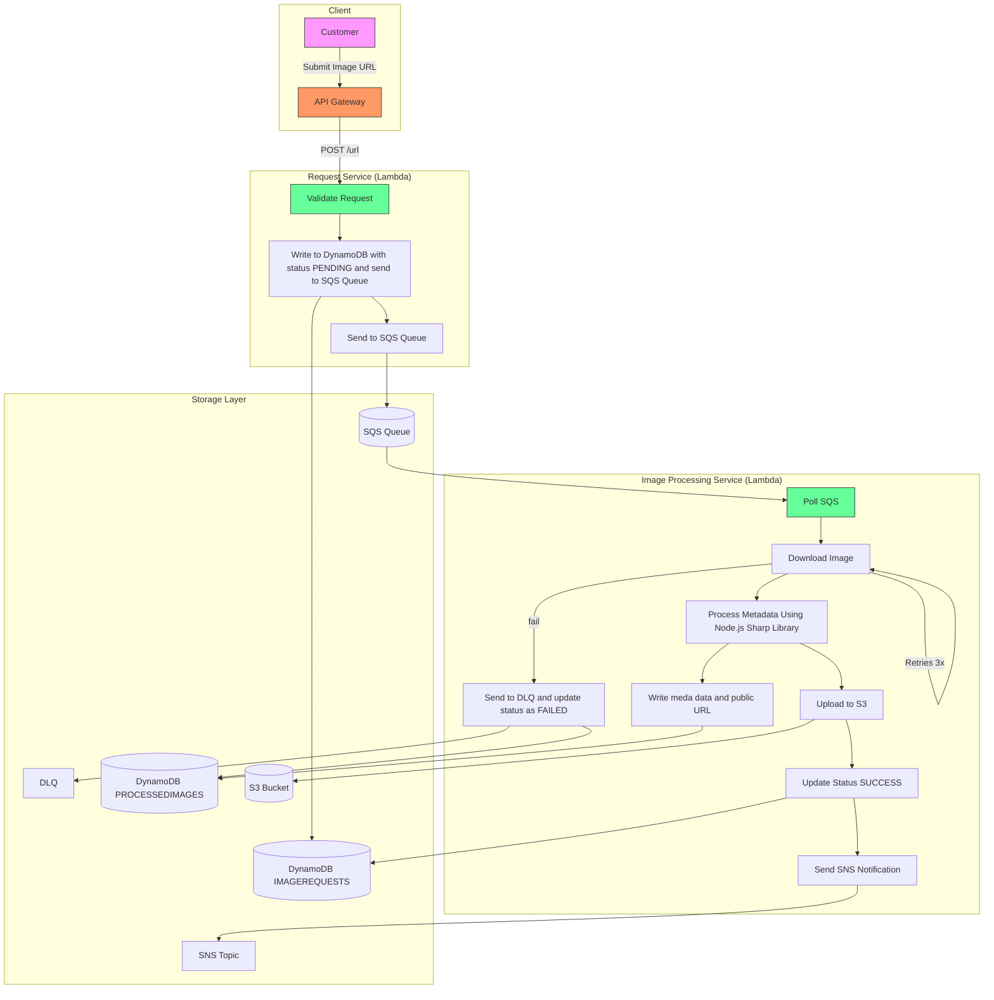
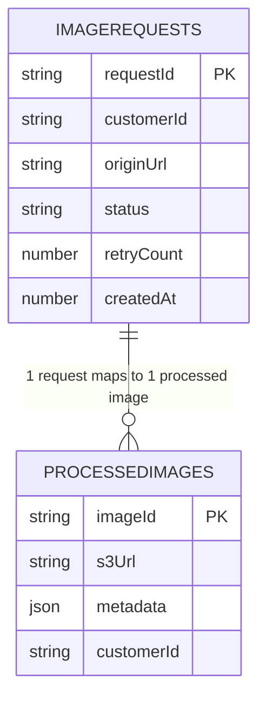
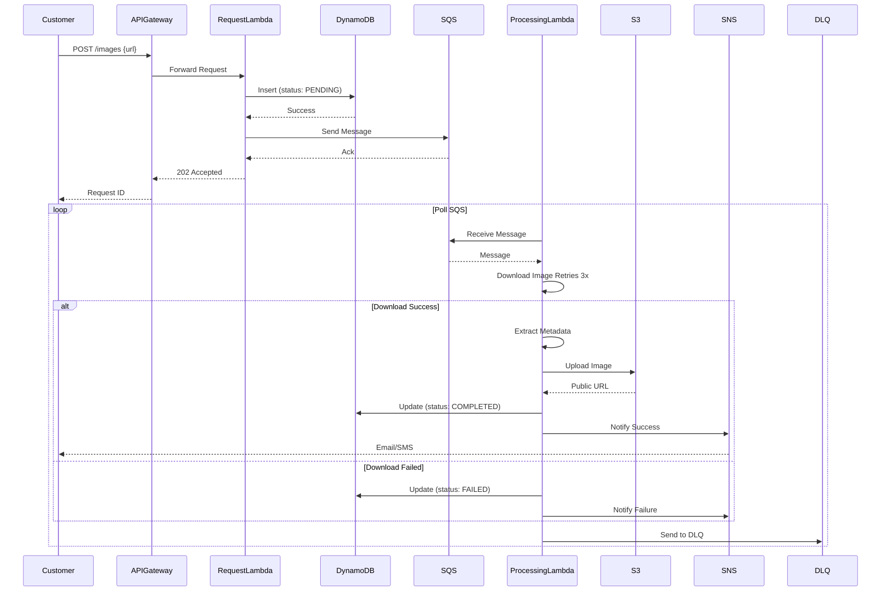
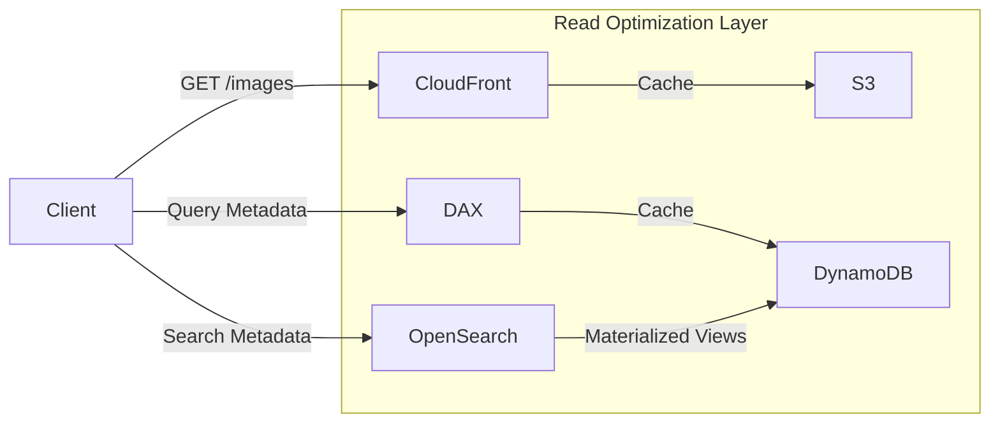

# Image Management Microservice Architecture on AWS

A scalable, fault-tolerant microservice architecture for processing millions of images asynchronously 
---

## Problem Statement
Design a system to:
1. **Insert images asynchronously** via customer-provided URLs.
2. **Process images** (download, extract metadata, store, generate public URLs).
3. **Notify customers** send them the public url when upload completes or a failure message.
4. Handle **millions of resources** with fault tolerance.

---

## Architecture Diagram

# Microservices & AWS Components:
## API Gateway

### AWS Service: Amazon API Gateway

**Role**: Entry point for clients to submit image URLs and fetch public URLs.

**Tech**: Node.js (Lambda integration for request validation/forwarding).

## Request Service

### AWS Service: AWS Lambda (Node.js) + Amazon SQS

**Role**:

Accepts image insertion requests via API Gateway.

Stores initial request in DynamoDB with status: PENDING.

Publishes a message to SQS for async processing.

## Image Processing Service

### AWS Service: AWS Lambda (Node.js) + Amazon ECS (optional for heavy processing)

**Role**:

Polls SQS for new requests (SQS queue has 100 messages and your batch size is 10 (configured in the event source mapping), Lambda spins up 10 concurrent instances each processing 10 messages).

Downloads the image from the customer’s URL.

Processes metadata (e.g., using sharp library in Node.js).

Stores the processed image in Amazon S3 and generates a public URL.

Updates DynamoDB with status: COMPLETED and public URL.

send to Dead Letter Queues after retries exhausted

## Storage Service

### AWS Service: Amazon S3 (Image Storage) + DynamoDB (Metadata)

**Role**:

S3 stores processed images with public-read ACL.

DynamoDB tracks request status, customer ID, and S3 URL.

## Notification Service

### AWS Service: Amazon SNS

**Role**: Sends SMS/email notifications when processing completes/fails.

## Entity Model

## Sequence Diagrams

# Read-Optimized Architecture

## Read Optimized Data Model & Additional Architecture Considerations
### Infrastructure-Based Optimizations
**API Gateway Caching**: Enable caching on API Gateway to reduce latency on frequently accessed queries.

**Amazon ElastiCache (Redis)**: Use a caching layer in front of DynamoDB to cache popular image metadata and public URLs.

**AWS Global Accelerator or CloudFront**: Use these for edge caching to improve access times globally.

## Entity Modeling Adjustments for Read Optimization
**Denormalization**: Store pre-aggregated or denormalized data in DynamoDB to serve read requests faster.

**Secondary Indexes**: Utilize DynamoDB Global Secondary Indexes (GSIs) to support queries on attributes such as status, upload time, etc.

**Elasticsearch**: For complex search queries and analytics, index image metadata in Amazon Elasticsearch Service (OpenSearch) for near real-time search capabilities
## Justification & Trade-offs
**Why This Design?**
Asynchronous Processing: SQS decouples submission from processing, ensuring scalability.

**Serverless**: Lambda + API Gateway reduce operational overhead.

**Fault Tolerance**:

1. SQS retries failed processing (visibility timeout).

2. Dead-letter queues (DLQ) handle poison pills.

**Data Isolation**: Each microservice owns its data (no shared databases).

**Rejected Alternatives:**
**Monolithic Database**: Would create tight coupling and scaling issues.

**EC2 Instead of Lambda:** Higher maintenance cost; Lambda scales better for sporadic workloads.

**Kinesis Instead of SQS:** Overkill for simple async workflows; SQS is cheaper.
